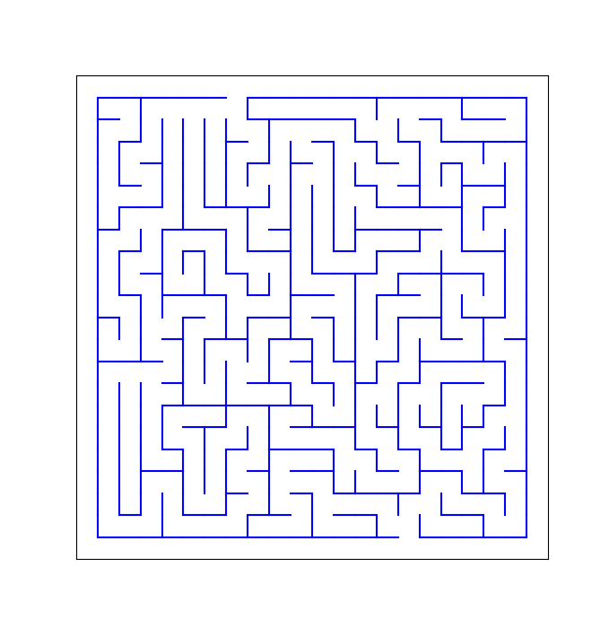
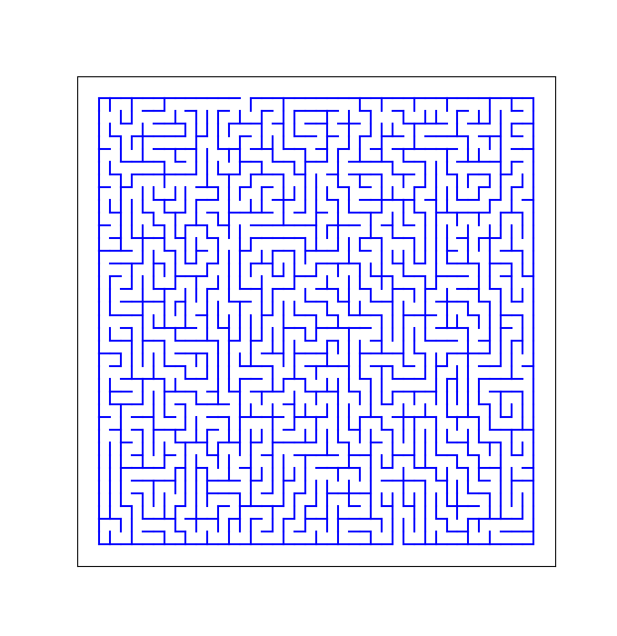

# Maze Generator
Use of spanning tree for path creation. The algorithm is doesnot produce true spanning tree it may consists loop.

## Usage
```
$ python main.py
```
Mention width and height from agruments:
```
$ python main.py --width=30 --height=40
```
Default width = 20 and height = 20

## Outcome
Default maze 20 by 20:


Maze 40 by 35     

